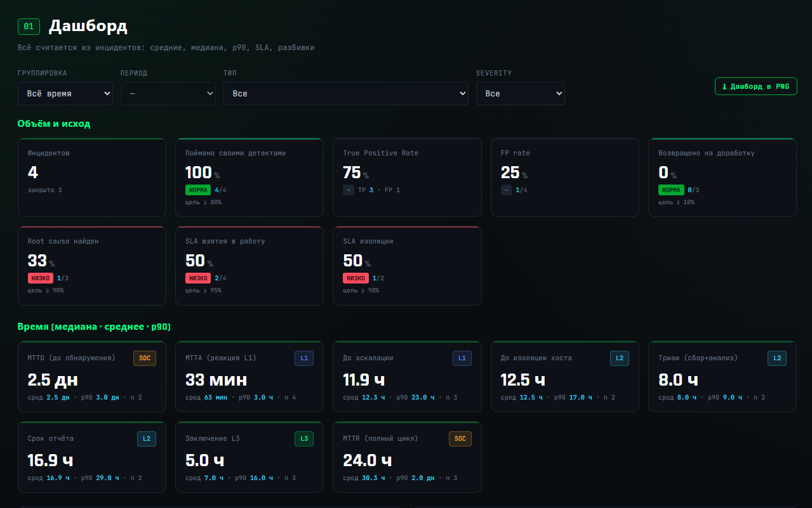

# ZavetSec-SOCMetrics


> Offline-first консоль метрик SOC: MTTD, MTTA, MTTR, SLA и MITRE ATT&CK — без сервера и зависимостей.

<p align="center">
  
</p>

`ZavetSec-SOCMetrics.html` — автономный инструмент, который рассчитывает метрики
эффективности SOC напрямую из данных по инцидентам. Вы фиксируете только факты и
временные отметки — **медианы, p90, SLA и аналитика считаются автоматически**:
по каждому этапу времени, доли TP/FP, переоткрытий и найденных root cause, источник
обнаружения, разбивки по типам, severity и технике MITRE ATT&CK.

Без бэкенда. Без сборки. Без сетевых запросов. Один файл, открываемый в браузере.

---

## Быстрый старт

1. Скачайте `ZavetSec-SOCMetrics.html`.
2. Откройте файл в браузере.
3. Заведите первый инцидент.

Работает полностью офлайн — в том числе с флешки или на изолированной машине.

> Встроенный каталог типов и пороги SLA — **иллюстративные значения по умолчанию**.
> Подстройте их под свой процесс на вкладках «Типы / MITRE» и «Пороги SLA».

---

## Ключевые показатели

- MTTD / MTTA / MTTR
- SLA по severity
- TPR / FPR / Root Cause
- Покрытие MITRE ATT&CK
- Аналитика по неделям / месяцам / кварталам

---

## Для кого

- Команды SOC L1 / L2 / L3
- DFIR и команды реагирования на инциденты
- MSSP и аутсорсинговые SOC
- Руководители SOC и CISO
- Те, кому нужен локальный инструмент метрик без построения отчётности в SIEM

---

## Возможности

- **На основе инцидентов.** Вносятся факты, а не готовые средние — расчёты делает инструмент.
- **Честная статистика.** Медиана и p90, а не только среднее (которое перекашивают выбросы).
- **Авто-SLA.** Соблюдение SLA рассчитывается автоматически из отметок времени и заданных порогов по severity.
- **MITRE ATT&CK.** Каждый тип инцидента привязан к технике; разбивка строит карту покрытия.
- **Редактируемый каталог.** Добавление / изменение / удаление типов инцидентов и техник прямо в интерфейсе.
- **Локально и приватно.** Все данные хранятся в вашем браузере (IndexedDB). Ничего не покидает страницу.
- **Переносимость.** Экспорт JSON / CSV и импорт JSON для резерва и переноса.
- **Ноль зависимостей.** Один `.html`-файл, тёмно-зелёная эстетика ZavetSec, работает офлайн.

---

## Метрики

**Время (медиана · среднее · p90):**

| Метрика | Интервал | Линия |
|---|---|---|
| MTTD — до обнаружения | обнаружен − компрометация | SOC |
| MTTA — реакция | взят в работу − обнаружен | L1 |
| Время до эскалации | эскалирован − взят в работу | L1 |
| Время до изоляции хоста | изолирован − обнаружен | L2 |
| Триаж (сбор + анализ) | триаж − эскалирован | L2 |
| Срок подготовки отчёта | отчёт − триаж | L2 |
| Время заключения L3 | заключён − отчёт | L3 |
| MTTR — полный цикл | заключён − обнаружен | SOC |

**Доли и исход:** поймано своими детектами, True Positive Rate (TPR),
False Positive Rate (FPR), доля инцидентов, возвращённых на доработку,
найден root cause, SLA взятия в работу, SLA изоляции.

**Разбивки:** по типам инцидентов, по технике MITRE, по severity.

---

## Почему не Excel

- данные вносятся на уровне инцидентов, а не агрегированных значений;
- медиана и p90 считаются автоматически;
- соблюдение SLA рассчитывается автоматически из отметок времени и заданных порогов;
- есть привязка к MITRE ATT&CK и разбивки по технике;
- нет риска случайно сломать формулу;
- инструмент полностью автономен и работает офлайн.

---

## Как это работает

1. **Инциденты** — заведите инцидент: выберите тип (он сам подставит технику MITRE и
   severity по умолчанию), укажите источник и вердикт, заполните доступные отметки времени.
   Обязателен только «Обнаружен», остальное — по мере прохождения инцидента.
2. **Дашборд** — выберите группировку (неделя / месяц / квартал / всё время) и при желании
   фильтры по типу и severity. Все показатели, распределения и разбивки пересчитываются сами.
3. **Типы / MITRE** — управление каталогом типов инцидентов и привязкой к ATT&CK.
4. **Пороги SLA** — задайте пороги по severity (в минутах); соблюдение SLA считается из них.
5. **Бэкап** — экспорт JSON / CSV или импорт JSON-резерва.

Линии определяются по этапам (взятие в работу → L1, изоляция/триаж/отчёт → L2,
заключение → L3) — без поимённого учёта.

---

## Данные и приватность

- Все данные хранятся локально через **IndexedDB** и привязаны к данному файлу в вашем браузере.
- Ничего не отправляется по сети — сетевого кода в инструменте нет вовсе.
- Данные привязаны к браузеру/профилю, где были созданы. Регулярно делайте **Бэкап → Экспорт JSON**.
- Очистка данных браузера удалит сохранённые инциденты — сначала экспортируйте.

---

## Принципы проекта

- Метрики из инцидентов, а не из агрегатов.
- Приватность по умолчанию.
- Офлайн как принцип проектирования.
- Ноль зависимостей.
- Прозрачные, проверяемые расчёты.

---

## О маппинге MITRE

Каталог «тип → техника» по умолчанию — разумная отправная точка, а не истина в последней
инстанции. Часть категорий обоснованно покрывает несколько техник; правьте каталог под то,
как у вас организованы детекты и плейбуки.

---

## Структура репозитория

```
ZavetSec-SOCMetrics.html   — сам инструмент (один файл)
README.md
LICENSE
CHANGELOG.md
docs/
    dashboard.png          — скриншот дашборда
```

---

## Дисклеймер

Предоставляется «как есть», без гарантий. Это инструмент измерения и процесса — он не
обнаруживает угрозы и не заменяет ваши SIEM/EDR. Ответственность за использование и за
вносимые данные лежит на вас.

---

## Лицензия

MIT — см. [LICENSE](LICENSE).

— **ZavetSec** · однофайловый DFIR/SOC-инструментарий · [github.com/zavetsec](https://github.com/zavetsec)
